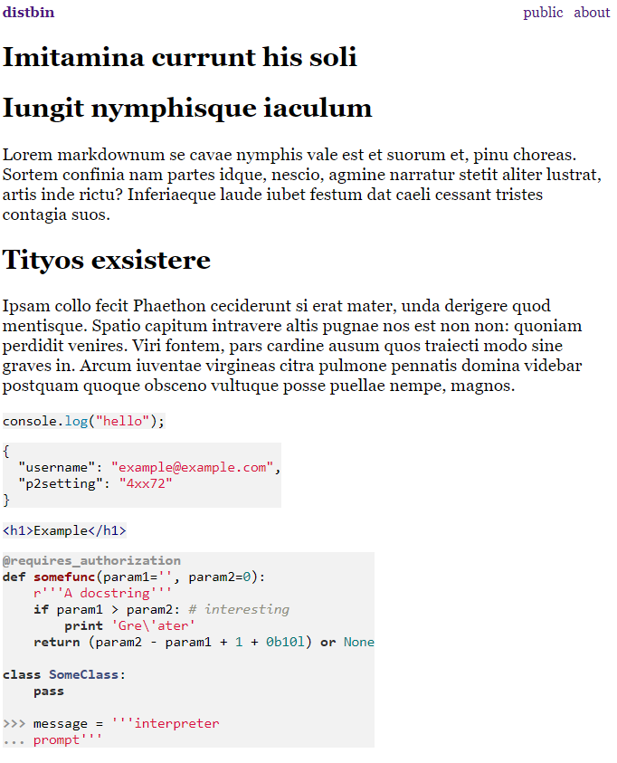

# Distbin pour YunoHost

[](https://dash.yunohost.org/appci/app/distbin)    
[](https://install-app.yunohost.org/?app=distbin)

*[Read this readme in english.](./README.md)*
*[Lire ce readme en français.](./README_fr.md)*

> *Ce package vous permet d'installer Distbin rapidement et simplement sur un serveur YunoHost.
Si vous n'avez pas YunoHost, regardez [ici](https://yunohost.org/#/install) pour savoir comment l'installer et en profiter.*

## Vue d'ensemble

A distributed pastebin. i.e. it is a service where anyone can post things on the web, and others can react by posting anywhere else on the web (including here).

A networked place to store posted web documents. This is meant to allow for distributed social commentary and reaction around these documents using best practices recommended or noted by the W3C Social Web Working Group.

### Features

- Ut enim ad minim veniam, quis nostrud exercitation ullamco ;
- Laboris nisi ut aliquip ex ea commodo consequat ;
- Duis aute irure dolor in reprehenderit in voluptate ;
- Velit esse cillum dolore eu fugiat nulla pariatur ;
- Excepteur sint occaecat cupidatat non proident, sunt in culpa."


**Version incluse :** 1.3.0~ynh9

**Démo :** https://distbin.com/

## Captures d'écran



## Avertissements / informations importantes

* No configuration parameters available for now.

## Documentations et ressources

* Site officiel de l'app : https://distbin.com/about
* Dépôt de code officiel de l'app : https://github.com/gobengo/distbin
* Documentation YunoHost pour cette app : https://yunohost.org/app_distbin
* Signaler un bug : https://github.com/YunoHost-Apps/distbin_ynh/issues

## Informations pour les développeurs

Merci de faire vos pull request sur la [branche testing](https://github.com/YunoHost-Apps/distbin_ynh/tree/testing).

Pour essayer la branche testing, procédez comme suit.
```
sudo yunohost app install https://github.com/YunoHost-Apps/distbin_ynh/tree/testing --debug
ou
sudo yunohost app upgrade distbin -u https://github.com/YunoHost-Apps/distbin_ynh/tree/testing --debug
```

**Plus d'infos sur le packaging d'applications :** https://yunohost.org/packaging_apps