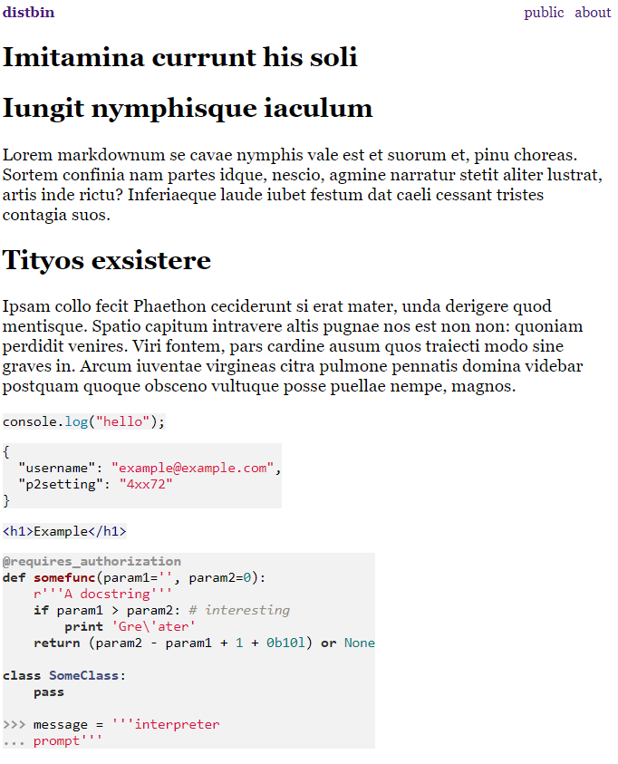

<!--
N.B.: Questo README è stato automaticamente generato da <https://github.com/YunoHost/apps/tree/master/tools/readme_generator>
NON DEVE essere modificato manualmente.
-->

# Distbin per YunoHost

[](https://dash.yunohost.org/appci/app/distbin)  

[](https://install-app.yunohost.org/?app=distbin)

*[Leggi questo README in altre lingue.](./ALL_README.md)*

> *Questo pacchetto ti permette di installare Distbin su un server YunoHost in modo semplice e veloce.*  
> *Se non hai YunoHost, consulta [la guida](https://yunohost.org/install) per imparare a installarlo.*

## Panoramica

A distributed pastebin. i.e. it is a service where anyone can post things on the web, and others can react by posting anywhere else on the web (including here).

A networked place to store posted web documents. This is meant to allow for distributed social commentary and reaction around these documents using best practices recommended or noted by the W3C Social Web Working Group.


**Versione pubblicata:** 1.3.0~ynh13

**Prova:** <https://distbin.com/>

## Screenshot



## Documentazione e risorse

- Sito web ufficiale dell’app: <https://distbin.com/about>
- Repository upstream del codice dell’app: <https://github.com/gobengo/distbin>
- Store di YunoHost: <https://apps.yunohost.org/app/distbin>
- Segnala un problema: <https://github.com/YunoHost-Apps/distbin_ynh/issues>

## Informazioni per sviluppatori

Si prega di inviare la tua pull request alla [branch di `testing`](https://github.com/YunoHost-Apps/distbin_ynh/tree/testing).

Per provare la branch di `testing`, si prega di procedere in questo modo:

```bash
sudo yunohost app install https://github.com/YunoHost-Apps/distbin_ynh/tree/testing --debug
o
sudo yunohost app upgrade distbin -u https://github.com/YunoHost-Apps/distbin_ynh/tree/testing --debug
```

**Maggiori informazioni riguardo il pacchetto di quest’app:** <https://yunohost.org/packaging_apps>
